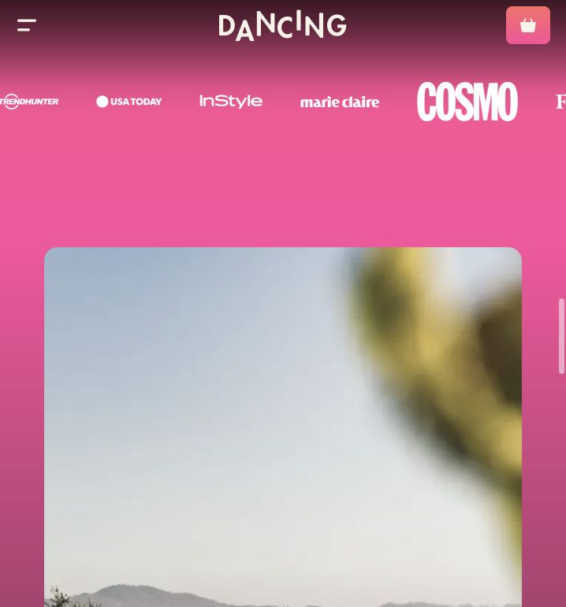
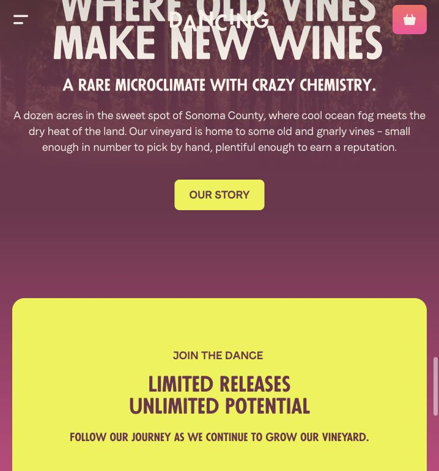

# Dancing scroll transition inspection

Source: https://www.wearedancing.com/, inspected live on October 6, 2026 using the Product Design audit workflow and Codex in-app browser at 718 × 771.

1. Hero → introduction. Seamless: the photo moves independently from the content. A 20vh transparent-to-coral gradient bridge ends at the exact coral color that begins the next wrapper. The hero photo layer was translated vertically when scrolled.

2. Introduction → products. Continuous: both occupy one background wrapper. Its gradient holds coral for the first 30%, then blends to pink across the remainder, including the club area. Product cards sit above the background rather than resetting its color.

3. Products → club → press logos. Continuous: the wrapper reaches pink. The club photo uses an inset rounded panel, retaining visible outer spacing. There is no new full-width solid background at the club boundary.

4. Press logos → vineyard story. Seamless: the story starts at the same pink and fades to plum by 50% of its section height. The photo container scales as scrolling progresses; its computed scale was approximately 0.837 at an intermediate position. Photo fade and section gradient connect the image to the copy beneath it.

5. Story → signup → footer. Seamless background, deliberate panel contrast: the signup wrapper begins at plum and fades back to pink. Its yellow rounded panel remains inset; outer margin reveals the gradient. The footer continues pink.

Implementation takeaway for Cai Mep: share matching endpoint colors across neighboring wrappers; apply broad gradients to the full background, including outer panel margins; animate photos independently. Preserve inset spacing at maximum panel scale. The observed gradients are attached to the document sections; the parallax impression comes from separate photo translations and scaling, rather than from animating every gradient stop.

Limits: this inspection covers visual motion and rendered DOM/computed styles at the captured viewport. Exact animation curves and reduced-motion behavior were not verified. Text over photos has contrast that varies with the image; accessibility compliance was not audited. No Cai Mep implementation was changed during this inspection.
